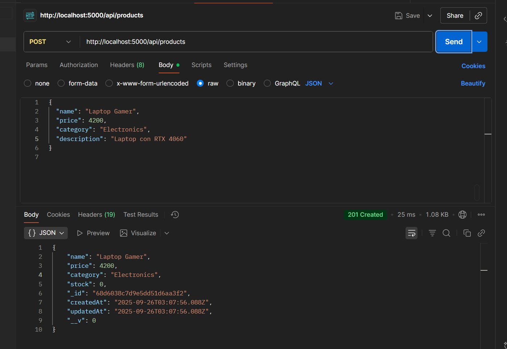

# Products API

A RESTful API to manage products, built with **Node.js**, **Express**, and **MongoDB**.
Supports CRUD operations, complex search with filters, pagination, and comes with Swagger documentation.

## Features

 +  CRUD operations for products ✅
 +  Search products by name, category, stock, price 🔍
 +  Pagination for product listings 📄
 +  Input validation with express-validator 🛡
 +  Security headers with helmet & cors 🔒
 +  API documented using Swagger 📑

 ## 🛠 Installation

1. **Clone the repository**

```
git clone https://github.com/AngelQuinteroDev/products-api
cd products-api
```
2. **Install dependencies**
```
npm install
```
3. **Configure environment variables**

Create a .env file in the root directory
```
PORT=5000
MONGO_URI=mongodb://127.0.0.1:27017/productsDB
```

4. **Run the server**

Development (auto-reload with nodemon)
```
npm run dev
```

The API will run at http://localhost:5000

## 📄 API Documentation

Explore and test the API interactively using Swagger:

http://localhost:5000/api-docs

## 🔗 Endpoints Overview


| Method  | Endpoint          |    Description        |
| --------|:-------------:    |:-------------:      |
| POST    |/api/products      |Create a new product
| GET     | /api/products     | List products with optional filters & |pagination                    |
| GET     | /api/products/:id |Get a product by ID
| PUT     | /api/products/:id | Update a product by ID                    |
| DELETE  | /api/products/:id |Delete a product by ID
| GET     | /api/search       |Search products using multiple filters                     |


## 📊 Examples (Postman)
1️⃣ Get all products
```
GET http://localhost:5000/api/products?page=1&limit=10

